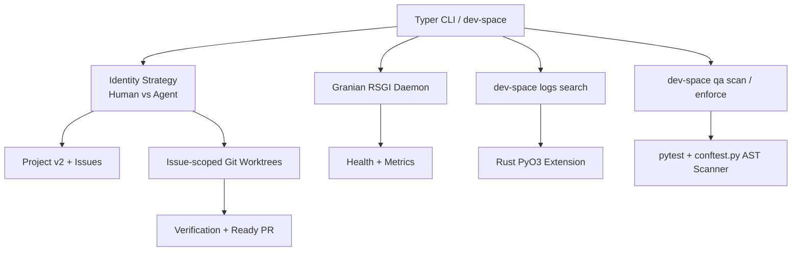

# dev-space

Agent-first development workflow orchestrator built with Python and Rust.

`dev-space` separates planner and worker identities, creates issue-scoped Git
worktrees, reconciles a GitHub Project v2 control plane, and hands verified work
off through verified pull requests. A PyO3 module provides subprocess execution
and log-file search primitives.

## Features

- **Issue-scoped sessions**: Recoverable Git worktrees, journals, branches, and
  gated pull-request handoff for one Agent-ready issue.
- **Identity lanes**: Separate GitHub configuration, SSH routing, commit identity,
  and repository authority for planner and worker actors.
- **GitHub control plane**: Typed Project v2 snapshot, reconciliation, issue
  hierarchy, dependency, readiness, and lifecycle contracts.
- **Verification gates**: Ruff, Pytest branch coverage, mutation score, Vulture,
  dependency audit, Rust tests, Clippy, and pull-request contract validation.
- **Health daemon**: Granian RSGI health and metrics endpoints.

---

## Architecture



## Installation

For local development, sync the locked environment and invoke the CLI through
`uv`:

```bash
uv sync --dev
uv run dev-space --help
```

## Usage: Human vs. Agent Intent

The CLI defaults to the worker (`agent`) identity lane. Use an explicit lane for
control-plane operations.

### As an Agent:
```bash
# Start a session for a Ready, Agent-ready GitHub issue
uv run dev-space --lane agent session start 59 --repo /home/user/src/dev-space

# Verify, push, mark the PR ready, and request review from the human planner
uv run dev-space --lane agent session handoff 59 --repo /home/user/src/dev-space
```

### Draft-to-review contract

A pull request may remain draft while the worker collects implementation
commits. `session handoff` is the only worker command that submits it for human
review. The command runs the policy-pinned focused and full verification suite,
pushes the final branch head, creates or updates exactly one draft pull request,
marks it ready through GitHub, requests the configured planner, and then moves
the Project item to `In Review`. Any failed step leaves the operation journal
recoverable and does not advance the Project state.

Issue `Ready` remains planner-owned. Pull-request “ready for review” only means
the worker has completed its verification handoff; approval, auto-merge, and
merge remain human-only, and repository checks still gate merge.

### As a Human:
```bash
# Inspect and reconcile the planner-owned Project v2
uv run dev-space --lane human project doctor --repo /home/user/src/dev-space
uv run dev-space --lane human project plan --repo /home/user/src/dev-space
```

### Managing the Daemon:
```bash
# Start the health/metrics daemon
uv run dev-space daemon start --port 8080

# Search configured log files through the Rust binding
uv run dev-space logs search gh --query "Exception"
```

## Security & QA

`dev-space` uses repository-local quality and control-plane checks. Tests enforce
structured telemetry on operational paths and explicit verification targets.
Branch coverage has a 90% repository floor. It is deliberately not a 100%
target: forcing every defensive or platform-specific line to execute tends to
reward trivial assertions and test-only implementation choices. Critical code
is instead mutation tested under the versioned `.dev-space/quality.toml`
policy. The repository-wide Mutmut target retains its 80% bootstrap baseline as
a non-regression ratchet, while critical targets require at least 90% and aim
for 100%. Constant-truth assertions, inline lint suppressions,
weakened QA configuration, warnings, dead code, and vulnerable dependencies are
separate failures. Small safety-critical modules may still require 100% branch
coverage when their contract justifies it.

To run the pipeline locally:
```bash
# Run lightweight static analysis (Ruff, Vulture, Pip-Audit)
uv run dev-space qa scan

# Run heavy enforcement (Pytest plus an enforced Mutmut score)
uv run dev-space qa enforce
```
