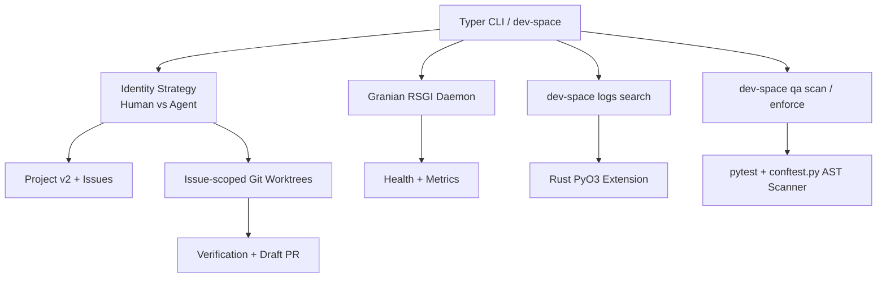

# dev-space

Agent-first development workflow orchestrator built with Python and Rust.

`dev-space` separates planner and worker identities, creates issue-scoped Git
worktrees, reconciles a GitHub Project v2 control plane, and hands verified work
off through draft pull requests. A PyO3 module provides subprocess execution and
log-file search primitives.

## Features

- **Issue-scoped sessions**: Recoverable Git worktrees, journals, branches, and
  draft-PR handoff for one Agent-ready issue.
- **Identity lanes**: Separate GitHub configuration, SSH routing, commit identity,
  and repository authority for planner and worker actors.
- **GitHub control plane**: Typed Project v2 snapshot, reconciliation, issue
  hierarchy, dependency, readiness, and lifecycle contracts.
- **Verification gates**: Ruff, Pytest coverage, Vulture, dependency audit, Rust
  tests, Clippy, and pull-request contract validation.
- **Daemon scaffold**: Granian RSGI health and metrics endpoints with scheduled
  loop placeholders. Log rotation, compression, and session reaping are not yet
  implemented.

---

## Architecture



## Installation

For local development, sync the locked environment and invoke the CLI through
`uv`:

```bash
uv sync --dev
uv run dev-space --help
```

## Usage: Human vs. Agent Intent

The CLI defaults to the worker (`agent`) identity lane. Use an explicit lane for
control-plane operations.

### As an Agent:
```bash
# Start a session for a Ready, Agent-ready GitHub issue
uv run dev-space --lane agent session start 59 --repo /home/user/src/dev-space

# Verify, push to the configured worker repository, and create/update a draft PR
uv run dev-space --lane agent session handoff 59 --repo /home/user/src/dev-space
```

### As a Human:
```bash
# Inspect and reconcile the planner-owned Project v2
uv run dev-space --lane human project doctor --repo /home/user/src/dev-space
uv run dev-space --lane human project plan --repo /home/user/src/dev-space
```

### Managing the Daemon:
```bash
# Start the health/metrics daemon
uv run dev-space daemon start --port 8080

# Search configured log files through the Rust binding
uv run dev-space logs search gh --query "Exception"
```

## Security & QA

`dev-space` uses repository-local quality and control-plane checks. Tests enforce
structured telemetry on operational paths and explicit verification targets.

To run the pipeline locally:
```bash
# Run lightweight static analysis (Ruff, Vulture, Pip-Audit)
uv run dev-space qa scan

# Run heavy enforcement (Pytest execution and Mutmut mutation elimination)
uv run dev-space qa enforce
```
