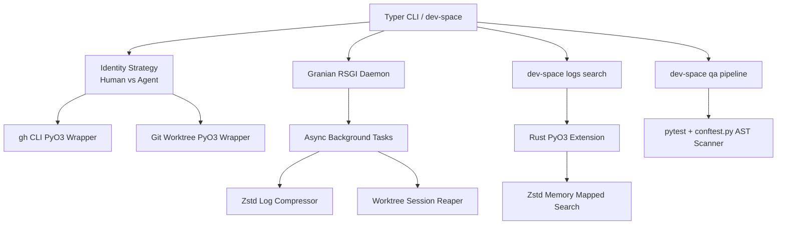

# dev-space

Agent-first development environment orchestrator built with Python and Rust.

`dev-space` guarantees safety and consistency by running dual-identities for AI coding agents and human developers, separating them into distinct Git session worktrees and SSH lanes. It utilizes a high-performance Rust PyO3 core to guarantee non-blocking system executions, log compression, and streaming search.

## Features

- **Agent Isolation Jails**: Ephemeral, disposable Git worktrees bound to specific sessions (`dev-space session start`).
- **Identity Lanes**: Automated SSH/Git config switching based on the `--lane` global flag (`human` vs `agent`), protecting your main GitHub account.
- **Rust Execution Core**: Safe execution of arbitrary terminal commands native in Rust (`pyo3`), protecting the Python GIL from IO deadlocks.
- **Zero-Trust QA Pipeline**: Strict runtime and static analysis enforcement, including AST scanning for test validity, `mutmut` mutation tests, and structured observability telemetry.
- **Background Daemon**: A Granian RSGI daemon handling UTC-midnight `.zst` log compressions, log rotations, and 6-hour git worktree pruning.

---

## Architecture



## Installation

You can install `dev-space` seamlessly via `uv`:

```bash
uv tool install dev-space
```

*(Alternatively, grab the pre-compiled `linux/x86_64` or `linux/aarch64` wheels directly from the GitHub Releases page).*

## Usage: Human vs. Agent Intent

By default, the CLI assumes `--lane=agent` to ensure maximum safety.

### As an Agent:
```bash
# Provision a safe isolation jail
$ dev-space session start task-1234
{"event": "Created worktree task-1234 at .dev-space/sessions/task-1234", "level": "info"}

# Execute PR checks safely as the agent identity
$ dev-space --lane=agent gh pr-list
```

### As a Human:
```bash
# Force the output to rich-text for human viewing and act as the human identity
$ dev-space --lane=human --rich gh auth-status
```

### Managing the Daemon:
```bash
# Start the background daemon
$ dev-space daemon start
{"event": "Starting Granian RSGI Server on port 8000", "level": "info"}

# Instant, native Rust log searching across massive `.zst` archives
$ dev-space logs search gh --query "Exception"
```

## Security & QA

`dev-space` uses a zero-trust QA pipeline. Any code must emit structural telemetry, and tests must pass `mutmut` mutation survival checks.

To run the pipeline locally:
```bash
# Run lightweight static analysis (Ruff, Vulture, Pip-Audit)
uv run dev-space qa scan

# Run heavy enforcement (Pytest execution and Mutmut mutation elimination)
uv run dev-space qa enforce
```